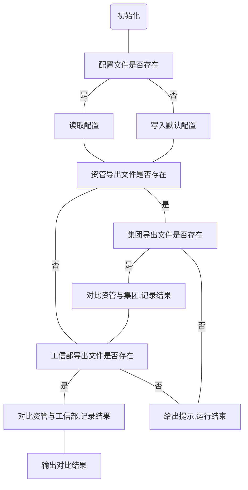

## 模板字段对比

```
资管      IP地址.2018-10-23.11.22.xlsx
集团      IP地址普通格式导出模板-IP地址-2018-11-12.xls
工信部    fpxxList20181023.xls
```

各模板字段对应表


| 序号 | 资管                  | 列   | 集团                  | 列   | 工信部 | 列   |
| ---- | --------------------- | ---- | --------------------- | ---- | ------ | ---- |
| 1    | IP地址                | D    | 网段名称              | B    |        |      |
| 2    | 联系人姓名(客户侧)    | K    | 联系人姓名(客户侧)    | M    |        |      |
| 3    | 联系电话(客户侧)      | L    | 联系电话(客户侧)      | N    |        |      |
| 4    | 分配使用时间          | M    | 分配使用时间          | R    |        |      |
| 5    | 单位详细地址          | X    | 单位详细地址          | L    |        |      |
| 7    | 联系人邮箱(客户侧)    | Y    | 联系人邮箱(客户侧)    | O    |        |      |
| 8    | 单位名称/具体业务信息 | AE   | 单位名称/具体业务信息 | C    |        |      |

基于 IP 地址，对比 3 个系统导出数据的以上 8 个字段。若与资管系统不一致，则列出 IP 地址及不一致的字段名称。

## 一致性检查工具流程图



其他使用方法，查看配置文件`config.ini`即可

```ini
# Author: Xianda

# 本配置为一致性检查工具的配置
# 如需恢复默认请删除本文件，重新生成的配置即为默认配置
# 如需修改配置，修改本文件后直接保存即可

######

# 若 IP 地址分为起始、终止的，filed1 字段中用“;”(英文分号)隔开
# 程序会依次对 filed 字段进行对比并输出对比结果
# filed 字段有变化可直接在此增删改，满足一一对应即可


[省内资管]
filed1 = IP地址
filed2 = 联系人姓名(客户侧)
filed3 = 联系电话(客户侧)
filed4 = 分配使用时间
filed5 = 单位详细地址
filed6 = 联系人邮箱(客户侧)
filed7 = 单位名称/具体业务信息

[集团]
filed1 = 网段名称
filed2 = 联系人姓名(客户侧)
filed3 = 联系电话(客户侧)
filed4 = 分配使用时间
filed5 = 单位详细地址
filed6 = 联系人邮箱(客户侧)
filed7 = 单位名称/具体业务信息

[工信部备案]
filed1 = 起始IP;终止IP
filed2 = 联系人姓名
filed3 = 联系电话
filed4 = 分配使用时间
filed5 = 单位详细地址
filed6 = 联系人电子邮箱
filed7 = 单位名称
```

