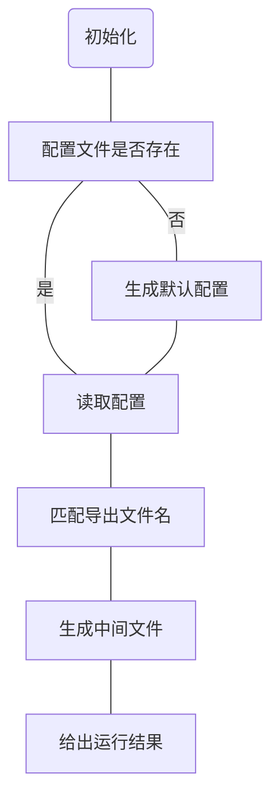

# 一致性检查工具使用说明

[更新历史](https://github.com/thianda/xda-tools/blob/master/ip-contrast/CHANGELOG.md)  [](https://github.com/thianda/xda-tools/tree/master/ip-contrast) 

## 快速开始:green_heart:

> 小工具为傻瓜式操作，将 3 个系统的导出的 **原始文件** 和小工具放在同文件夹，直接运行小工具即可
> 首次运行会在目录下生成后缀为 `ini` 的配置文件，如导出的模板数据格式（字段标题）有变化，可修改配置解决，其他情况也可联系作者。

1. 从 3 个系统导出数据。（若只有 2 个系统的数据，需至少包含`省内资管`）注意不要修改导出数据的文件名和内容。
2. 将导出文件和小工具放在同一个文件夹，双击运行。运行时显示进度，结束后按任意键可打开生成的结果。
3. 结果中最后两列为对比结果。

> 结果显示 `TRUE` 为一致，`FALSE` 为不一致。
> `#N/A` 为省内资管存在其他系统不存在，详见下面的 **过滤数据** 章节。
> 运行时闪退、运行结果不理想等情况，请阅读下面的 **其他注意事项** 章节。

## 模板字段对比

系统导出的模板，文件名包含的关键字如下：

|导出文件|文件名关键字|
|-|-|
|省内资管|IP地址.|
|集团 |-IP地址-|
|工信部|fpxxList|

各模板字段对应表


| 序号 | 省内资管              | 集团                  | 工信部         |
| ---- | --------------------- | --------------------- | -------------- |
| 1    | IP地址                | 网段名称              | 起始IP;终止IP  |
| 2    | 联系人姓名(客户侧)    | 联系人姓名(客户侧)    | 联系人姓名     |
| 3    | 联系电话(客户侧)      | 联系人电话(客户侧)    | 联系人电话     |
| 4    | 分配使用时间          | 分配使用时间          | 分配日期       |
| 5    | 单位详细地址          | 单位详细地址          | 单位详细地址   |
| 6    | 联系人邮箱(客户侧)    | 联系人邮箱(客户侧)    | 联系人电子邮件 |
| 7    | 单位名称/具体业务信息 | 单位名称/具体业务信息 | 使用单位名称   |

其中的 `IP` 字段：

```ini
省内资管：     包含掩码
集团：        每个 IP 一行
工信部：      起始 IP，终止 IP 分为两列
```

本工具运行时会根据导出模板文件生成中间文件，中间文件中只保留需要对比的字段，并补充修改 IP 字段为`起始 IP`、`结束 IP` 两个字段（INT 类型）。生成过程中过滤无用的数据。

## 过滤数据

| 数据表     | 特征/列      | 特征/关键字 |
| ---------- | ------------ | ----------- |
| 集团       | 单位详细地址 | (空)        |
| 工信部备案 | 单位详细地址 | (空)        |

**如有其他可基于特征进行过滤的数据，请告知我。**

基于对应表格的对应列，过滤空值数据。在生成文件中插入 excel 公式。

运行结束后，自动打开一致性检查结果所在的文件夹。

## 一致性检查工具流程图



## 程序生命周期

1. 检查配置文件。不存在则生成默认配置。
2. 检查配置文件是否正确。依据：每份数据的对比字段个数要一致。
3. 基于配置中，文件名包含的关键字，识别同目录下的导出文件。
4. 选择每份数据的第一个文件第一个 sheet 页，识别各对比字段的所在列。
5. 依次加载每一个文件，遍历筛选每一个 sheet 页数据。（耗时巨大）
6. 保存筛选的数据到文件。
7. 按任意键打开结果文件所在位置。

## 其他事项说明

- :heavy_check_mark: 由于 `申请时间` 字段格式可能不统一，现已添加时间格式强制转换。 
- :heavy_exclamation_mark: 导出数据可能手动修改过，比如新建了额外的 sheet 页，若新建的 sheet 页名字为`Sheet*`（如：Sheet1、Sheet2，...），小工具可自动过滤跳过该 sheet 页，防止找不到数据。其他修改可能导致小工具运行出错。
- :persevere: 如遇闪退，建议在 `cmd` 中运行：->按住 `shift` 键，文件夹空白处右键选择“在此处打开命令行”，输入程序名，输入时可用 `tab` 键补全。 
- :x: ​由于 IP 地址成段的合并，造成 excel 公式无法匹配成段 IP 地址中的单个 IP。需手动判断。将来计划解决。解决思路：:one: 在小工具配置文件中手动添加白名单，强制认为白名单中的 IP 符合一致性要求。:two: 在小工具内置算法将 IP 地址段拆分后对比（运行效率会大幅度降低，暂不考虑）。
- :rocket: ​下个版本急需解决运行效率问题。

## 默认配置

导出模板如有微小变化，查看并修改配置文件`config.ini`即可，默认的完整配置如下：

```ini
# Author: Xianda

# 本配置为一致性检查工具的配置
# 如删除本配置文件，重新生成的配置文件即为默认配置
# 如需修改配置，修改本文件后直接保存即可

######

# before 表示数据的起始行（列名占用的行数）。现已自动识别（配置无效）
# 若 IP 地址字段分为起始IP、终止IP的，`ip` 字段中用“;”(英文分号)隔开
# 程序会依次对 field 字段进行对比并输出对比结果
# field 字段有变化可直接在此增删改，满足一一对应即可


[common]
version = 0.8.4

[对比文件名]
省内资管 = IP地址.
集团 = -IP地址-
工信部备案 = fpxxList

[省内资管]
tag1 = 所属地市
ip = IP地址
starttime = 分配使用时间
field3 = 联系人姓名(客户侧)
field4 = 联系电话(客户侧)
field5 = 单位详细地址
field6 = 联系人邮箱(客户侧)
field7 = 单位名称/具体业务信息

[集团]
tag1 = 所属地市
ip = 网段名称
starttime = 分配使用时间
field3 = 联系人姓名(客户侧)
field4 = 联系人电话(客户侧)
field5 = 单位详细地址
field6 = 联系人邮箱(客户侧)
field7 = 单位名称/具体业务信息

[工信部备案]
tag1 = 所属地
ip = 起始IP;终止IP
starttime = 分配日期
field3 = 联系人姓名
field4 = 联系人电话
field5 = 单位详细地址
field6 = 联系人电子邮件
field7 = 使用单位名称
```

## 编译

```python
pyinstaller -F ip-contrast.py -i ../__favicon/favicon.ico -n [version]
```

